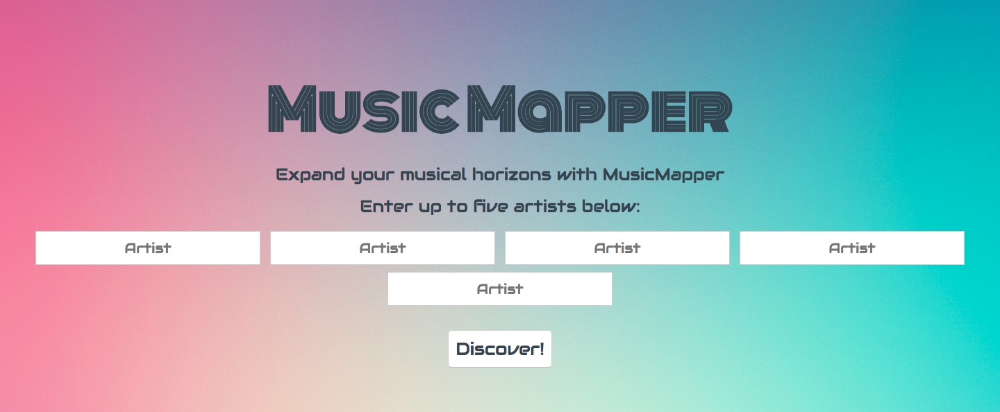
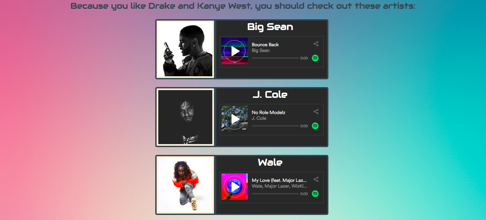

# Music Mapper
## This application allows you to search for new and interesting artists based on a set of artists that you are interested in.

API and Endpoints used:
- Spotify Web Api
- Music Mapper
This application allows you to search for new and interesting artists based on a set of artists that you are interested in.

## API and Endpoints used:
-	[Spotify Web API](https://developer.spotify.com/web-api/)

In this application, I used the Spotify Web API to research the artists and find their related artists to suggest new music.   

### User input data:
Find related artists based on search input from the user:

### Application output:
- A list of interesting related artists to listen to:




